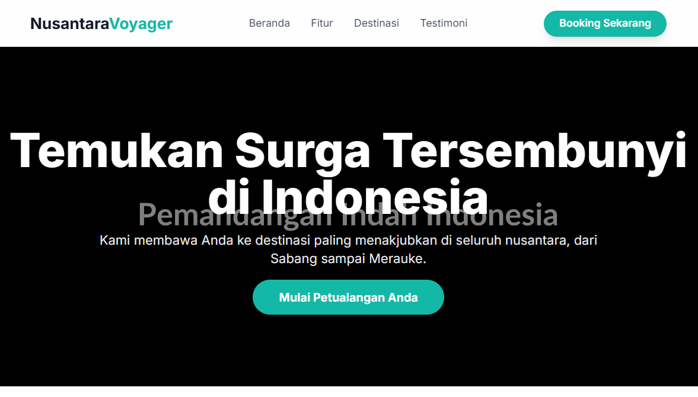

# Nusantara Voyager - Landing Page Agen Perjalanan



Ini adalah proyek landing page (halaman arahan) untuk sebuah agen perjalanan fiksi bernama **Nusantara Voyager**. Situs web ini dirancang untuk menjadi modern, menarik secara visual, dan sepenuhnya responsif, menampilkan keindahan destinasi wisata di Indonesia.

---

## ✨ Fitur Utama

-   **Desain Modern & Bersih**: Tampilan yang profesional menggunakan skema warna yang menenangkan dan tipografi yang mudah dibaca.
-   **Sepenuhnya Responsif**: Tampilan optimal di semua perangkat, dari ponsel, tablet, hingga desktop.
-   **Animasi Halus**: Efek transisi dan animasi sederhana untuk meningkatkan pengalaman pengguna.
-   **Struktur Terorganisir**: Kode dipisahkan menjadi file HTML, CSS, dan JavaScript untuk kemudahan pengelolaan.
-   **Ikon Modern**: Menggunakan [Lucide Icons](https://lucide.dev/) untuk ikonografi yang tajam dan konsisten.

---

## 🛠️ Teknologi yang Digunakan

Proyek ini dibangun menggunakan teknologi web standar:

-   **HTML5**: Untuk struktur dan konten halaman.
-   **CSS3**: Untuk styling.
    -   **[Tailwind CSS](https://tailwindcss.com/)**: Framework CSS berbasis utilitas untuk mempercepat proses desain dan styling.
-   **JavaScript**: Untuk fungsionalitas interaktif seperti menu mobile.

---

## 🚀 Cara Menjalankan Proyek

Untuk menjalankan proyek ini di komputer lokal Anda, ikuti langkah-langkah berikut:

1.  **Clone atau Unduh Repositori**
    Jika proyek ini ada di Git, Anda bisa meng-clone-nya. Jika tidak, cukup unduh file-filenya.

2.  **Siapkan Struktur Folder**
    Pastikan Anda memiliki struktur folder seperti di bawah ini:
    ```
    /nusantara-voyager
      |- index.html
      |- style.css
      |- script.js
      |- 404.html
    ```

3.  **Buka di Browser**
    Cukup buka file `index.html` langsung di browser web favorit Anda (seperti Chrome, Firefox, atau Edge).

Tidak ada proses kompilasi atau dependensi yang rumit yang perlu diinstal!

---

## 📁 Struktur File

-   `index.html`: File utama yang berisi semua struktur HTML dari halaman web.
-   `style.css`: Berisi style kustom tambahan dan animasi. Sebagian besar styling dilakukan langsung di HTML menggunakan kelas Tailwind CSS.
-   `script.js`: Berisi kode JavaScript untuk fungsionalitas interaktif, seperti mengaktifkan menu navigasi mobile.

---

## ☁️ Deployment

Proyek ini siap untuk di-deploy di berbagai platform hosting statis seperti:

-   **Firebase Hosting**
-   GitHub Pages
-   Netlify
-   Vercel

Panduan untuk deploy ke Firebase Hosting telah disediakan secara terpisah.

